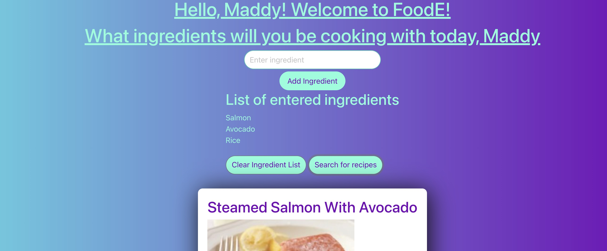

# <FOODE App>

## Description

This project is an app that allows you to ad specific ingredients and get recipes that contain them. It is meant to inspire home cooks to creatively use what they already have in their refrigerators. They can also save recipes they like for future use.

## Installation

Open the script.js, style.css and index.html files in VS Code.

## Usage

Type your name so FoodE can great you. Enter the ingredients you want to use.

[a link] https://mwathomas.github.io/project-1/

Next steps to be built out might be nutrition facts, ability to search by diet, ability to save based on user name, and

## Credits

Madeline Thomas, Kai Gerstley, Hugo Yanez, David Silveira, Fethan Us
